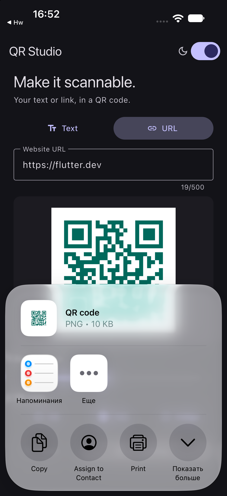
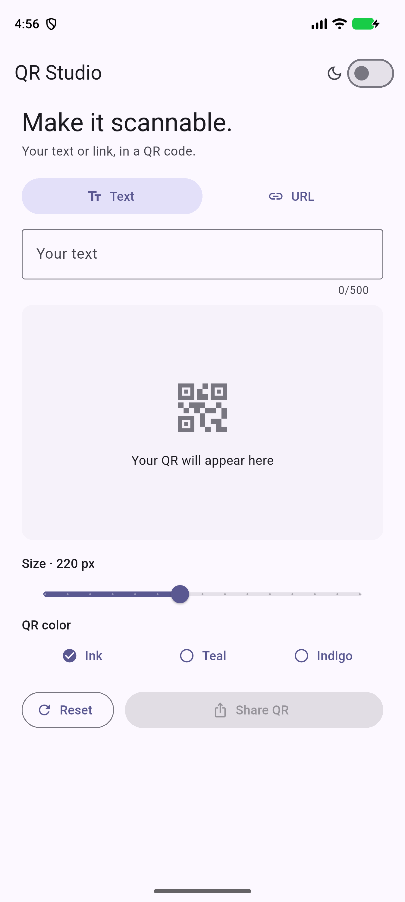
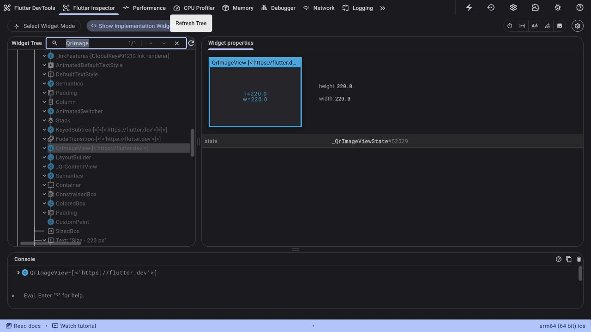
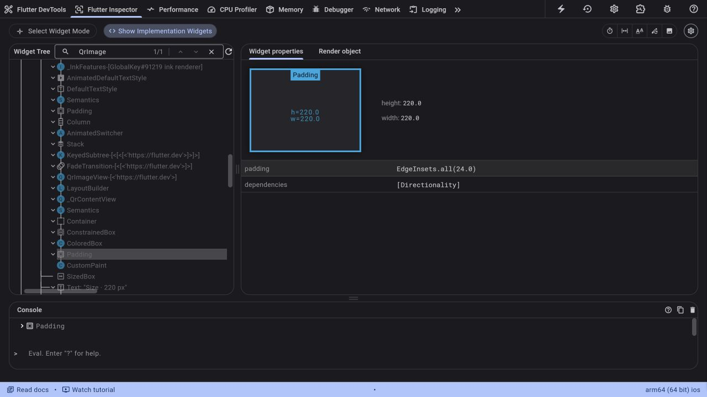
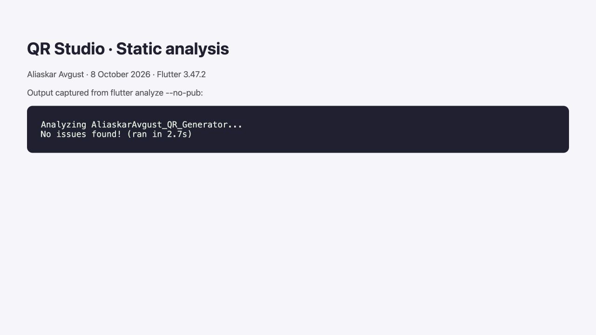

# QR Studio

Aliaskar Avgust · Mobile Development I

A Flutter QR generator with text and URL modes.

## Features

- `Form` and `TextFormField`: empty input, more than 500 characters and invalid HTTP/HTTPS URLs show an error. Invalid input hides the QR and disables sharing.
- Live preview with `setState` and `qr_flutter`.
- Size slider (160–300 logical pixels), three QR colors and a reset button. On a narrow screen, the preview fits the available width.
- Light and dark themes using `ColorScheme.fromSeed`. The theme is stored in the root widget and changed through a callback.
- `AnimatedSwitcher` with a 250 ms fade and `ValueKey(text)`.
- Bonus: Share QR opens the system share sheet with a 1024 × 1024 PNG using `share_plus`.

Reset clears the input and restores Text mode, 220 px and Ink. It keeps the chosen light/dark theme. The QR always has a white background and dark modules so it stays readable in either theme. Exported images include a white quiet zone.

## Screenshots

## Run

On the prepared Mac: open `ios/Runner.xcworkspace`, select **Runner → iPhone Simulator**, then press **▶**.

After downloading a fresh copy, open this project folder in VS Code with the Flutter extension. Open `pubspec.yaml` and use **Get Packages**, choose a running Android emulator or iPhone simulator, then **Run → Start Debugging**. Flutter, Xcode (for iOS) and Android SDK (for Android) must already be installed.

## Code

- `lib/main.dart`: theme, form, validation, state, preview and controls.
- `lib/qr_image.dart`: PNG export for the sharing bonus. `QrPainter` draws the code onto a white canvas; `dart:ui` encodes the PNG.
- `test/`: input, interaction, layout and PNG checks.

Runtime dependencies: [qr_flutter](https://pub.dev/packages/qr_flutter) and [share_plus](https://pub.dev/packages/share_plus). No additional state-management package.

## DevTools report

Checked on iPhone 18 Pro Simulator, iOS 27.0, Flutter 3.47.2 / Dart 3.13.2.

### Widget Inspector

Selected `QrImageView` in the widget tree. The default preview is **220 × 220 logical pixels**, with **24 px padding** on each side.

### Rebuild comparison

Two isolated versions of the same small screen were compared: a text field, QR preview and an unchanged settings widget. One used `setState` in the parent; the other updated a `ValueNotifier<String>` read by `ValueListenableBuilder` around the preview. `SettingsPanel()` was not const in either version, so the comparison measures the scope of the rebuild rather than const-widget reuse.

Entered `abcdefghij`, one character every 200 ms. Enabled widget build tracing through the same Flutter service extension used by DevTools. Counts below come from Flutter Timeline events; the initial screen build is excluded.

| Widget                                 | setState | ValueNotifier |
| -------------------------------------- | -------: | ------------: |
| Parent screen (`RebuildDemo`)        |       10 |             0 |
| QR preview (`Preview`)               |       10 |            10 |
| Unchanged settings (`SettingsPanel`) |       10 |             0 |
| `ValueListenableBuilder`             |        0 |            10 |

[Recorded counts](screenshots/rebuild-counts.json)

Both approaches update the QR on every character. `ValueNotifier` avoids rebuilding the parent and unrelated controls. This assignment uses `setState` because the screen is small and the code is easier to follow. These are debug-mode rebuild counts, not release-performance timings or FPS measurements.

To repeat the inspection: run the app from VS Code, open **Flutter: Open DevTools → Flutter Inspector**, and select the QR. For rebuilds, open **Performance → Enhance Tracing**, enable widget-build tracking and type ten characters.

## Verification

- `flutter analyze`: no issues.
- `flutter test`: 8 tests passed.
- Layout checked at 320 × 568, 844 × 390 and 768 × 1024, including keyboard space.
- Android arm64 debug APK and iOS simulator debug build succeeded. The final Android build installed and launched on the Pixel 10 Pro XL emulator.
- iPhone simulator: text/URL input, live QR, color, dark mode and native PNG share sheet checked.
- Exported PNG decoded independently with Apple Vision: `https://flutter.dev`.
- No physical-device testing; delivery to third-party messaging apps was not performed.

The image below displays the actual captured analyzer output.

